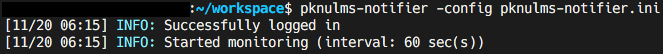
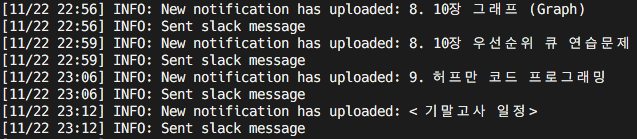
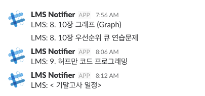

# pknulms-notifier

Pukyong National University LMS notifier for Slack

## Screenshots

Logging in:



You can check your job log:



It posts message to slack channel:



## Installation

If you want an executable binary, see [Releases](https://github.com/hallazzang/pknulms-notifier/releases).

Or build from latest source code and install into `$GOPATH/bin`:
```bash
$ go get -u github.com/hallazzang/pknulms-notifier
```

This will put `pknulms-notifier` into your `$GOPATH/bin`.

## Configuration

You should provide configuration file to run the program.
Open your favorite editor and write one:

```ini
interval = 30 ; Crawling interval in seconds

[lms]
id = YOUR_STUDENT_NO ; Your LMS ID(=student number)
pw = YOUR_PASSWORD ; Your LMS password

[slack]
webhook-url = SLACK_WEBHOOK_URL ; "https://hooks.slack.com/services/.../.../..."
```

Save it as `config.ini` or whatever you want.

## Run

If you've added `$GOPATH/bin` to your `$PATH`, you can simply run it:
```bash
$ pknulms-notifier -config=/path/to/config.ini
```

Otherwise, you would do like:
```bash
$ $GOPATH/bin/pknulms-notifier -config=/path/to/config.ini
```

## Requirements

pknulms-notifier is written in Golang 1.9.2. Go version under 1.7 might not work.
